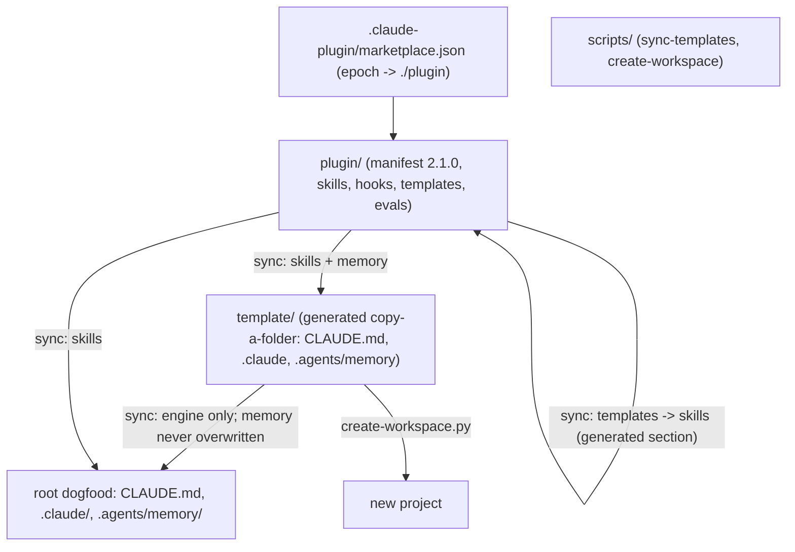

# Active State & Current Architecture

This file documents the active state, current configurations, code graph, and verification status of the current project.

> [!IMPORTANT]
> **Concision Constraint**: Keep all entries in this file extremely concise. Prune deprecated modules or obsolete state immediately to preserve token space.

---

## Active Stack Details

| Layer | Technology | Key Details |
| :--- | :--- | :--- |
| **Framework** | Markdown protocol | Files under `.agents/memory/` are the whole runtime state |
| **Language/Typing** | Markdown, Python 3 | Python only for `scripts/` tooling |
| **Testing** | Behavioral (`EVALUATION.md`) | Manual QA script walked against a fresh session |
| **Deployment** | None | Distributed by copying `template/` |

---

## Architecture / Code Graph

*Describe the high-level architecture or monorepo structure here.*



### Module Descriptions

- **`CLAUDE.md`**: Protocol entry point loaded every session: Startup SOP, memory map, command index.
- **`.claude/`**: Claude Code-native engine. `rules/core-directives.md` (always loaded), `skills/{init,plan,milestone,checkpoint,scaffold-module}/SKILL.md`, `settings.json` (SessionStart hook).
- **`.agents/memory/`**: Harness-neutral state for *this* repository's own development. Never overwritten by sync.
- **`template/`**: Pristine source of truth mirroring the root layout, with blank memory templates (`protocol_version: 2.0`).
- **`scripts/`**: `sync-templates.py` (template -> root, idempotent) and `create-workspace.py` (template -> new project + interview + git init).
- **`EVALUATION.md`**: Six-phase behavioral test script for a fresh Claude Code session.

---

## Environment / Security Notes

- No secrets or cloud resources. Live harness config files (`.agents/settings.json`, `.agents/mcp_config.json`) are git-ignored; see `.agents/mcp_config.example.json`.

---

## Verification Commands

<!-- One shell command per line inside the fenced block. `/checkpoint` runs them in order from the repository root and stops at the first failure. Leave the block empty if verification is not configured. -->

```bash
npx --yes markdownlint-cli2 "**/*.md" "#node_modules"
python3 scripts/sync-templates.py
diff -r plugin/skills .claude/skills && diff -r plugin/skills template/.claude/skills && diff -r plugin/templates/memory template/.agents/memory && diff template/CLAUDE.md CLAUDE.md
claude plugin validate --strict ./plugin
claude plugin validate --strict .
```

---

## Verification Compliance Status

We enforce strict validation criteria. The current status is:

1. **Type Checks**: N/A
2. **Linting**: `markdownlint-cli2` clean (config in `.markdownlint-cli2.yaml`).
3. **Test Suites**: N/A (behavioral evaluation only)
4. **Production Builds**: N/A (sync idempotence checked: `sync-templates.py` then `git diff --quiet`)
